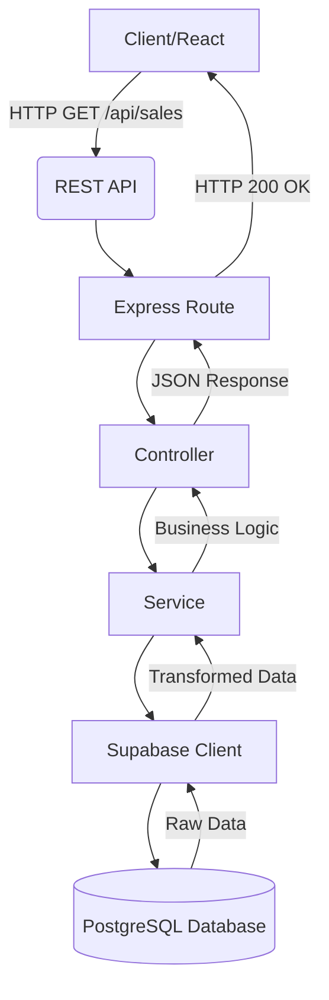

# Retail Intelligence & Stock Management: Backend Interview Prep Guide

This document is a complete, line-by-line technical breakdown of your backend specifically designed for your upcoming internship interview.

> [!TIP]
> **How to use this guide:** Read through sections A-I to understand exactly how your code works. Then, use section J to test yourself against the exact questions an interviewer will ask you.

---

## A. Backend Overall Architecture

Your backend follows a strict **Layered Architecture** (often called an N-Tier architecture). This is a professional standard because it separates concerns: networking is separate from validation, which is separate from business logic, which is separate from the database.

**The Complete Flow:**


**Interview Explanation:**
*"My backend uses a layered architecture to keep code clean and maintainable. When React makes a request, it hits an Express **Route**, which passes the request to a **Controller**. The controller handles the HTTP part (status codes, JSON) and calls a **Service**. The service contains all the business logic and talks to **Supabase (PostgreSQL)** to fetch the data. The data then flows back up the chain to the client."*

---

## B. Project Configuration Files

These files tell Node.js and TypeScript how to run your project.

### `package.json`
- **Location:** `backend/package.json`
- **Purpose:** Defines the project metadata, scripts, and dependencies.
- **Key Dependencies:**
  - `express`: The core web server framework.
  - `cors`: Middleware to allow your React frontend (on port 5173) to talk to the backend (on port 5000) without browser security blocking it.
  - `@supabase/supabase-js`: The official client library to query your PostgreSQL database securely.
  - `typescript`, `tsx`, `@types/*` (Dev Dependencies): Tools to compile and run TypeScript code.
- **Interview Explanation:** *"package.json is the heart of the Node project. It lists my dependencies like Express for the server and Supabase for the database, and defines my `npm run dev` script."*

### `package-lock.json`
- **Location:** `backend/package-lock.json`
- **Purpose:** Locks the exact version of every dependency (and sub-dependency) installed, ensuring the project runs identically on any machine.

### `tsconfig.json`
- **Location:** `backend/tsconfig.json`
- **Purpose:** Configures the TypeScript compiler. It enforces strict typing rules and tells the compiler to output the compiled JavaScript into the `dist/` folder.

### `.env` / `.env.example`
- **Location:** `backend/.env`
- **Purpose:** Stores secret environment variables (like `SUPABASE_URL` and `SUPABASE_KEY`). The `.env.example` is committed to Git to show teammates what keys are required, while `.env` is ignored by Git to keep secrets safe.

---

## C. Application Entry/Setup

### `app.ts`
- **Location:** `backend/src/app.ts`
- **Purpose:** Configures the Express application and registers all middleware and routes.
- **Important Code:**
  - `const app = express();`: Creates the Express application instance.
  - `app.use(cors({ origin: "http://localhost:5173" }));`: Explicitly allows the React frontend to make requests.
  - `app.use(express.json());`: Middleware that parses incoming HTTP requests with JSON payloads.
  - `app.use('/api/products', productRoutes);`: Registers the URL prefix for specific route files.
- **Interview Explanation:** *"app.ts is where I configure my Express server. I set up middleware like CORS and JSON parsing, and I map all my base URLs to their specific route handlers. I keep it separate from the server start logic so the app is easier to test."*

### `server.ts`
- **Location:** `backend/src/server.ts`
- **Purpose:** The actual entry point that starts the server listening on a port.
- **Important Code:**
  - `app.listen(PORT, ...)`: Binds the Express app to port 5000 and starts listening for HTTP traffic.
- **Interview Explanation:** *"server.ts imports the configured app from app.ts and simply calls app.listen() to start the server. Separating app and server is a best practice for testing."*

---

## D. Config

### `supabase.ts`
- **Location:** `backend/src/config/supabase.ts`
- **Purpose:** Initializes the Supabase client connection to PostgreSQL.
- **Important Code:**
  ```typescript
  import { createClient } from '@supabase/supabase-js';
  import dotenv from 'dotenv';
  
  dotenv.config();
  
  const supabaseUrl = process.env.SUPABASE_URL || '';
  const supabaseKey = process.env.SUPABASE_KEY || '';
  
  export const supabase = createClient(supabaseUrl, supabaseKey);
  ```
- **Interview Explanation:** *"This file loads my secret API keys from the .env file using the dotenv package, and creates a singleton instance of the Supabase client that the rest of my services can import and use to query the database."*

---

## E. Routes

Route files map specific HTTP methods and endpoints to their respective Controller functions. 

> [!NOTE]
> All routes in this project are read-only (`GET`) to power the dashboard.

1. **`productRoutes.ts`**: `GET /api/products` → `productController.getProducts` (Fetches product catalog)
2. **`branchRoutes.ts`**: `GET /api/branches` → `branchController.getBranches` (Fetches store locations)
3. **`saleRoutes.ts`**: `GET /api/sales` → `saleController.getSales` (Fetches raw sales history)
4. **`inventoryRoutes.ts`**: `GET /api/inventory` → `inventoryController.getInventory` (Fetches raw stock levels)
5. **`stockMovementRoutes.ts`**: `GET /api/stock-movements` → `stockMovementController.getStockMovements` (Fetches inventory changes)
6. **`salesAnalysisRoutes.ts`**: `GET /api/sales-analysis` → `salesAnalysisController.getSalesAnalysis` (Fetches aggregated KPI data)
7. **`inventoryIntelligenceRoutes.ts`**: `GET /api/inventory-intelligence` → `inventoryIntelligenceController.getInventoryIntelligence` (Fetches stock health analysis)
8. **`decisionImpactRoutes.ts`**: `GET /api/decision-impact` → `decisionImpactController.getDecisionImpact` (Fetches automated reorder decisions)
9. **`healthRoutes.ts`**: `GET /api/health` → `healthController.checkHealth` (Simple ping to check if server is alive)

---

## F. Controllers

Controllers act as the traffic cops. They don't contain business logic. They receive the HTTP Request (`req`), call a Service, and send back the HTTP Response (`res`).

**Example: `salesAnalysisController.ts`**
- **Receives:** `GET` request.
- **Calls Service:** `await getSalesAnalysis()`
- **Sends Response:** `res.status(200).json({ success: true, data })`
- **Error Handling:** Wraps the service call in a `try/catch` block. If the service throws an error, it catches it and sends `res.status(500).json({ success: false, message: 'Server error' })`.

**Interview Explanation:** *"My controllers are intentionally very thin. Their only job is to extract data from the HTTP request, pass it to the service layer, and then format the service's output into a standard JSON HTTP response with the correct status codes. This keeps my business logic completely decoupled from HTTP protocols."*

---

## G. Services (The Core Business Logic)

This is the most important part of the backend. Services contain the actual "intelligence" of the Retail Intelligence Dashboard.

### 1. `salesAnalysisService.ts`
- **Purpose:** Converts raw sales rows into high-level KPIs and aggregates.
- **Step-by-step logic:**
  1. Calls `getSales()` to fetch all raw sales from the database.
  2. Initializes counters: `total_sales_amount`, `total_units_sold`. Uses `sales.length` for `total_transactions`.
  3. Loops through every sale.
  4. Parses the database strings into numbers: `Number(sale.quantity)`, `Number(sale.total_amount)`.
  5. Adds the sale amounts to the grand totals.
  6. **Product Aggregation:** Checks if the `product_id` exists in a `productMap` dictionary. If not, it creates an entry. It adds the sale's quantity, amount, and transaction count to that specific product's running total.
  7. **Branch Aggregation:** Does the exact same mapping process for `branch_id`.
  8. **Top Products Sorting:** Converts the `productMap` into an array, and uses `.sort()` to sort them first by `total_quantity` (descending), and if tied, by `total_amount`. It then uses `.slice(0, 5)` to grab the top 5.
  9. Returns the final aggregated object.

### 2. `inventoryIntelligenceService.ts`
- **Purpose:** Analyzes raw stock levels to determine the health of the inventory.
- **Step-by-step logic:**
  1. Calls `getInventory()` to fetch raw stock levels.
  2. Loops through every inventory record.
  3. Parses `quantity` and `reorder_level` into numbers.
  4. **The Logic:** Evaluates `const isLowStock = qty <= reorder;`
  5. Assigns a status string: `'LOW_STOCK'` or `'HEALTHY'`.
  6. Increments either the `low_stock_items` or `healthy_stock_items` counter.
  7. Pushes the enriched item data into an array.
  8. Returns the summary counts and the array of evaluated items.

### 3. `decisionImpactService.ts`
- **Purpose:** Generates automated, actionable decisions based on the inventory intelligence.
- **Step-by-step logic:**
  1. Calls `getInventoryIntelligence()` to get the already-evaluated stock data.
  2. Loops through the intelligence items.
  3. **The Logic:** Checks `if (item.stock_status === 'LOW_STOCK')`. It ignores healthy items completely.
  4. **Impact Logic:** `const estimated_impact = item.quantity === 0 ? 'HIGH' : 'MEDIUM';` (If we are totally out of stock, the impact is HIGH. If we are just below the reorder level, it's MEDIUM).
  5. Generates a human-readable `description` string.
  6. Returns an array of automated `REORDER` decisions.

**Interview Explanation:** *"My services are where the real work happens. Instead of relying on complex database JOINs or SQL views, I fetch the raw data and use TypeScript maps, reducers, and standard business logic to aggregate KPIs, evaluate inventory health thresholds, and automatically generate reorder decisions. By doing this in Node.js, the logic is highly testable and decoupled from the database dialect."*

---

## H. Types

TypeScript interfaces live in `backend/src/types/`. They define the exact shape of your data.

**Example: `salesAnalysis.ts`**
- **Represents:** The complex aggregated data structure returned by the sales service.
- **Properties:**
  - `total_sales_amount: number`
  - `top_selling_products: ProductSalesAggregate[]`
- **Why it's useful:** It provides autocompletion in your editor, prevents you from spelling variables wrong, and ensures the Frontend exactly matches the Backend.

---

## I. Complete Request Lifecycle

Let's trace exactly what happens when the Dashboard loads the **Inventory Health** chart:

1. **React:** The `Dashboard.tsx` component mounts and calls `api.getInventoryIntelligence()`.
2. **Fetch:** The browser sends an HTTP `GET` request to `http://localhost:5000/api/inventory-intelligence`.
3. **Express Route:** `app.ts` sees `/api/inventory-intelligence` and routes it to `inventoryIntelligenceRoutes.ts`.
4. **Controller:** The route calls `inventoryIntelligenceController.getInventoryIntelligence(req, res)`.
5. **Service:** The controller calls `getInventoryIntelligence()` in the service file.
6. **Supabase:** The service calls `getInventory()`, which uses the Supabase client to run a `SELECT * FROM inventory` query on PostgreSQL.
7. **Business Logic:** The database returns raw rows. The service loops through them, compares `quantity <= reorder_level`, counts the low stock items, and builds the intelligence object.
8. **Response:** The controller wraps that object in `{ success: true, data: [...] }` and sends it back as JSON with a 200 OK status.
9. **React:** The frontend receives the JSON and passes it into the Recharts `<PieChart>` component.

---

## J. Interview Preparation Questions

> [!IMPORTANT]
> Practice answering these out loud without reading the answers first.

### General Backend (20 Questions)
1. **Q:** What architecture does your backend use? 
   **A:** A layered N-Tier architecture separating Routes, Controllers, Services, and Database.
2. **Q:** Why did you separate Controllers and Services? 
   **A:** To separate HTTP logic (req/res, status codes) from business logic, making the code cleaner and easier to test.
3. **Q:** What does `app.use(express.json())` do?
   **A:** It's a middleware that parses incoming request bodies into JSON so they can be accessed via `req.body`.
4. **Q:** What is CORS and why did you need it?
   **A:** Cross-Origin Resource Sharing. Browsers block requests from one port (5173) to another (5000) for security. CORS tells the browser it's allowed.
5. **Q:** How do you handle environment variables?
   **A:** Using the `dotenv` package to load secrets from a `.env` file into `process.env`.
6. **Q:** What happens if a service throws an error?
   **A:** The controller's `catch` block catches it and returns a 500 Internal Server Error to the client, preventing the server from crashing.
7. **Q:** Why use Supabase instead of raw PostgreSQL?
   **A:** Supabase provides a powerful, typed JavaScript client that makes querying the database much faster and safer than writing raw SQL strings.
8. **Q:** How did you structure your Git repository for this?
   **A:** I used a monorepo style with separate `frontend/` and `backend/` folders, each with their own `package.json`.
9. **Q:** What is a Promise in JavaScript?
   **A:** An object representing the eventual completion or failure of an asynchronous operation, like fetching data from a database.
10. **Q:** Why is `async/await` used in your controllers?
    **A:** Because database calls take time. `await` pauses the execution of the function until the Promise resolves, making asynchronous code look synchronous and easier to read.
11. **Q:** How did you calculate the top-selling products?
    **A:** I aggregated sales into a dictionary by `product_id`, converted it to an array, sorted by quantity descending, and sliced the top 5.
12. **Q:** What determines if an item is "Low Stock"?
    **A:** If its current quantity is less than or equal to its predefined reorder level.
13. **Q:** How does the automated decision system decide if an impact is HIGH or MEDIUM?
    **A:** If an item is low stock, it checks if the quantity is exactly 0. If 0, impact is HIGH. Otherwise, it's MEDIUM.
14. **Q:** Are your API routes RESTful?
    **A:** Yes, they use standard HTTP verbs (GET) and noun-based endpoint names (e.g., `/api/sales`).
15. **Q:** How would you add a feature to create a new product?
    **A:** I would add a `POST /api/products` route, create a controller to parse `req.body`, and a service to execute a Supabase `insert()` query.
16. **Q:** What's the difference between `dependencies` and `devDependencies`?
    **A:** Dependencies are needed for the app to run in production (like Express). DevDependencies are only needed for development (like TypeScript).
17. **Q:** How do you start this backend locally?
    **A:** By running `npm run dev`, which uses `tsx` to compile and watch the TypeScript files, starting the server on port 5000.
18. **Q:** What does `req` and `res` stand for?
    **A:** The HTTP Request object (data coming in) and the HTTP Response object (data going out).
19. **Q:** If you wanted to filter sales by date, where would that logic go?
    **A:** The controller would read the date from `req.query`, and pass it to the service, which would add a filter to the Supabase query.
20. **Q:** Why did you choose Node.js for this backend?
    **A:** Because it's fast, event-driven, handles asynchronous I/O well, and allows me to use a single language (TypeScript) across the entire stack.

### Deep Technical (10 Questions)
1. **Q:** What is the Event Loop in Node.js?
   **A:** It's what allows Node.js to perform non-blocking I/O operations despite being single-threaded, by offloading operations to the system kernel.
2. **Q:** How does `Promise.all` work in your frontend Dashboard?
   **A:** It takes an array of promises (my 5 API calls) and runs them concurrently, resolving only when *all* of them have finished, which is much faster than running them sequentially.
3. **Q:** In your sales analysis service, you use `Number(sale.quantity)`. Why?
   **A:** PostgreSQL `numeric` types are sometimes returned as strings by database drivers to prevent JavaScript floating-point precision loss. `Number()` ensures we can do math on them.
4. **Q:** What is a singleton? Is your Supabase client a singleton?
   **A:** A singleton is a class/object that is instantiated only once. Yes, the Supabase client initialized in `supabase.ts` is exported and shared across all files.
5. **Q:** How would you scale this backend if traffic increased 100x?
   **A:** I would run multiple instances of the Node server using a load balancer, and add caching (like Redis) for the analysis data since it requires looping over large datasets.
6. **Q:** Explain dependency injection. Do you use it?
   **A:** Dependency injection is passing dependencies (like a database client) into a function rather than hardcoding them. I didn't use it strictly here for simplicity, but I could pass the Supabase client into my services to make unit testing easier.
7. **Q:** How do you handle SQL injections?
   **A:** By using the Supabase client, which utilizes parameterized queries under the hood, making SQL injection practically impossible.
8. **Q:** What is the time complexity (Big O) of your sales analysis logic?
   **A:** It's O(N log N). Looping through the sales is O(N), but the `.sort()` algorithm at the end is typically O(N log N).
9. **Q:** Why is your `.env` file in `.gitignore`?
   **A:** To prevent API keys and database credentials from being pushed to a public GitHub repository, which is a massive security risk.
10. **Q:** What is Middleware in Express?
    **A:** Functions that have access to the request and response objects, and the `next` function. They can modify the request, end the response, or pass control to the next middleware (like CORS or JSON parsing).

### Specific Tech Questions

**TypeScript (5)**
1. What are Interfaces? *(A way to define the shape of an object).*
2. What does `Promise<SalesAnalysisData>` mean? *(It means the function is async and will eventually return an object matching the SalesAnalysisData interface).*
3. Why use TypeScript over JavaScript? *(It catches errors at compile-time instead of runtime and provides excellent editor autocomplete).*
4. What is `any` and why should you avoid it? *(It disables type checking. You lose all the benefits of TypeScript).*
5. How did you resolve the `verbatimModuleSyntax` error? *(By explicitly using `import type { ... }` when importing interfaces, telling the compiler it's purely a type).*

**Express (5)**
1. What is Express? *(A minimal and flexible Node.js web application framework).*
2. What is routing? *(Determining how an application responds to a client request to a particular endpoint).*
3. What is the difference between `req.params` and `req.query`? *(Params are part of the URL path like `/users/:id`. Query is after the question mark like `/users?sort=asc`).*
4. What status code is returned for a successful GET request? *(200 OK).*
5. What status code is used for an internal server error? *(500).*

**Supabase / PostgreSQL (5)**
1. What is Supabase? *(An open-source Firebase alternative powered by PostgreSQL).*
2. What is a UUID? *(Universally Unique Identifier. It's much safer and harder to guess than auto-incrementing integers).*
3. What is PostgreSQL? *(A powerful, open-source object-relational database system).*
4. How do you query all rows in a table using Supabase JS? *( `supabase.from('table_name').select('*')` ).*
5. What is a Foreign Key? *(A column that creates a link between two tables, like `product_id` in the `sales` table linking to the `products` table).*

---

## ⚡ The 1-Page Backend Cheat Sheet

**1. The Stack:** Node.js, Express, TypeScript, Supabase.
**2. The Architecture:** Route → Controller → Service → DB.
**3. The Separation of Concerns:** 
   - **Controllers:** Handle HTTP traffic (JSON, Status Codes). NO BUSINESS LOGIC.
   - **Services:** Handle data processing, math, and database calls. NO HTTP LOGIC.
**4. The Business Logic:**
   - **Sales:** Fetches raw sales, aggregates them in dictionaries by ID, sorts by quantity to find top sellers.
   - **Inventory:** Checks if `Quantity <= Reorder Level` to flag as `LOW_STOCK`.
   - **Decisions:** Looks at low stock items. If `Quantity == 0`, impact is `HIGH`, else `MEDIUM`.
**5. Why TypeScript?** Compile-time safety. Interfaces ensure the frontend maps exactly to what the backend returns.
**6. Most impressive part of your project:** *"Instead of a basic CRUD app, I built an intelligence layer. My Node.js services process raw transactional data and transform it into automated business decisions (reorder alerts) and high-level KPIs, mimicking a real enterprise dashboard."*
